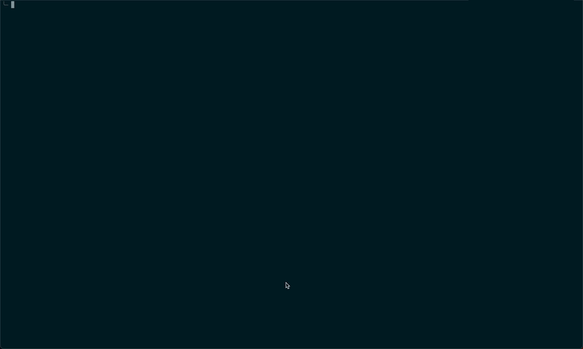

# Claude Buddy Picker

A CLI tool to customize your [Claude Code](https://docs.anthropic.com/en/docs/claude-code) companion buddy. Pick your buddy's species, rarity, eyes, hat, shininess, and stats -- then patch the CLI binary so your custom buddy appears every time.



## How It Works

1. **Backup** -- Saves your current `.claude.json` and strips any existing companion data
2. **Pick** -- Interactive prompts let you choose every aspect of your buddy
3. **Patch** -- Writes your choices directly into the Claude Code CLI binary

## Prerequisites

- **Node.js** >= 18
- **Claude Code** installed via npm global or native installer

## Installation

```bash
git clone https://github.com/<your-username>/claude-buddy-picker.git
cd claude-buddy-picker
npm install
```

## Usage

```bash
npm start
```

Follow the interactive prompts to configure your buddy:

| Property | Options |
|----------|---------|
| Rarity | common, uncommon, rare, epic, legendary |
| Species | duck, goose, blob, cat, dragon, octopus, owl, penguin, turtle, snail, ghost, axolotl, capybara, cactus, robot, rabbit, mushroom, chonk |
| Eyes | `·` `✦` `×` `◉` `@` `°` |
| Hat | none, crown, tophat, propeller, halo, wizard, beanie, tinyduck |
| Shiny | yes / no |
| Stats | DEBUGGING, PATIENCE, CHAOS, WISDOM, SNARK (0-100 each) |

After confirming, the tool patches your Claude Code CLI. Run `claude` and type `/buddy` to see your custom companion.

## Restoring the Original CLI

Re-install Claude Code to restore the unpatched binary:

```bash
# npm global
npm install -g @anthropic-ai/claude-code

# native installer
curl -fsSL https://claude.ai/install.sh | sh
```

Your `.claude.json` backup is saved at `~/.claude.json.backup`.

## License

[MIT](LICENSE)
